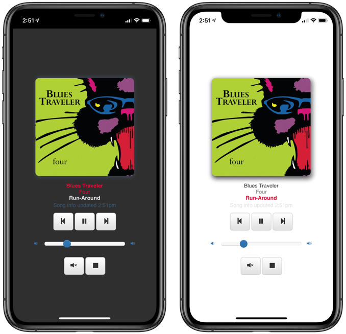

Utilities to display [`shairport-sync`](https://github.com/mikebrady/shairport-sync) metadata (via MQTT)[1](#f1)

See [REQUIREMENTS](REQUIREMENTS.md) for other things you'll need (like AirPlay source, AirPlay receiver such as `shairport-sync`, MQTT broker, and software or hardware renderers/displays.

### Webserver webapp

[python-flask-socketio-server](python-flask-socketio-server/#readme) - [README.md](python-flask-socketio-server/README.md)

-	Displays currently playing track info, including cover art.
-	Configurable UI. Dark-mode support.
-	Support for mobile browsers. Webapp manifest.
-	Playback controls.

### Display on 16x2 Character LCD

[circuitpython_char_lcd](circuitpython_char_lcd/#readme) - [README.md](circuitpython_char_lcd/README.md)

-	Configurable display and UI.
-	Playback remote control and volume support.
-	Tested using CircuitPython i2c LCD library on a Raspberry Pi.

### Display album art thumbnails on HUB75 LED Panels

[python-flaschen-taschen](python-flaschen-taschen/#readme) - [python-flaschen-taschen](python-flaschen-taschen/README.md)

-	Tested with 32 x 32 RGB LED panels

### LICENSE

Code and documentation Copyright © 2019-2021 David Crook under [MIT License](LICENSE).

---

<i id="f1">1</i>: MQTT metadata support released in `shairport-sync` [Version 3.3](https://github.com/mikebrady/shairport-sync/releases/tag/3.3)[⤸](#a1)
